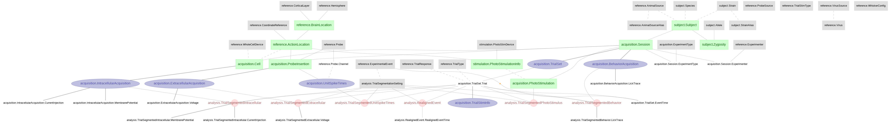

# Guo, Inagaki et al., 2017
Data pipeline for Guo, Inagaki et al., 2017 from Svoboda Lab.

This study revealed the thalamic neurons exhibited selective persistent delay activity that predicted movement direction, which is similar to the anterior lateral motor cortex (ALM). This data pipeline contains the ephys and behavior data, and their corresponding analysis that replicate the figures in the paper.

This project presents a DataJoint pipeline design for the data accompanying the paper
> Zengcai V. Guo, Hidehiko K. Inagaki, Kayvon Daie, Shaul Druckmann, Charles R. Gerfen & Karel Svoboda. "Maintenance of persistent activity in a frontal thalamocortical loop" (2017) Nature

https://dx.doi.org/10.1038/nature22324

The data: https://dx.doi.org/10.6080/K03F4MH (Not available)

## Design DataJoint data pipeline 
This repository contains the **Python 3.7** code of the DataJoint data pipeline design for this dataset, as well as scripts for data ingestions and visualization

## Conversion to NWB 2.0
This repository contains the **Python 3.7** code to convert the DataJoint pipeline into NWB 2.0 format (See https://neurodatawithoutborders.github.io/)
Each NWB file represents one recording session. The conversion script can be found [here](scripts/datajoint_to_nwb.py)

## Demonstration of the data pipeline
Data queries and usages are demonstrated in this [Jupyter Notebook](notebooks/guo-inagaki-2017_example.ipynb), where several figures from the paper are reproduced. 

## Schema Diagram

